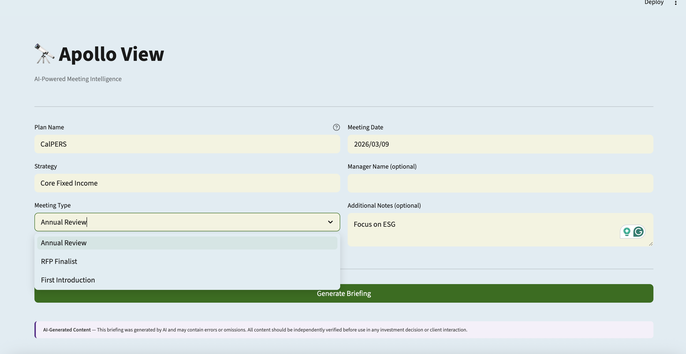
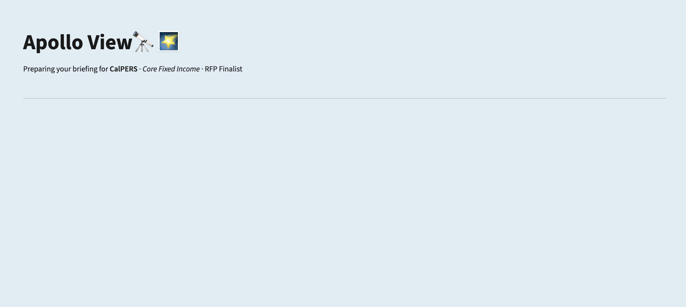
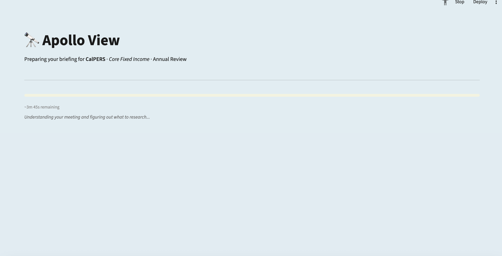
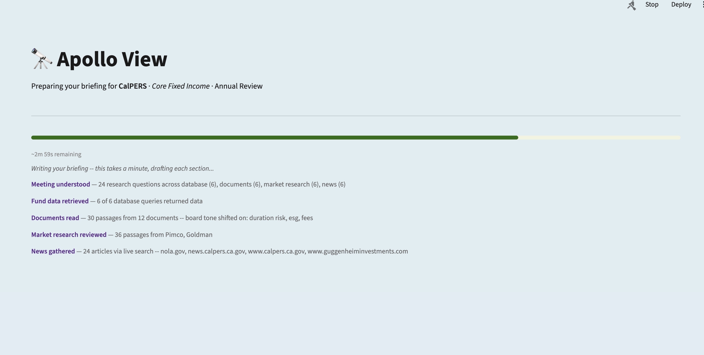
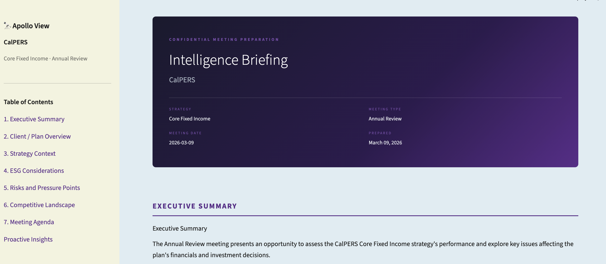
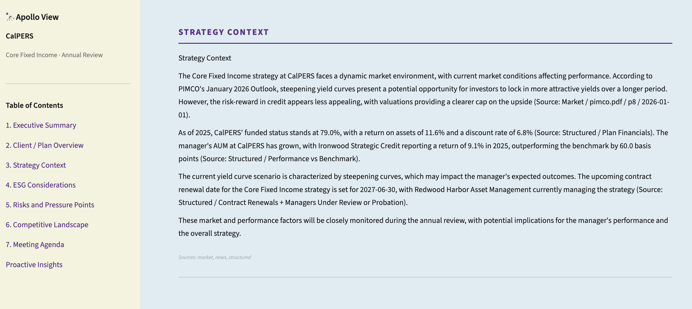
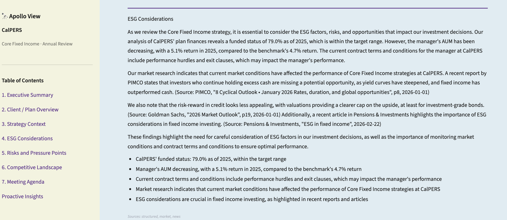
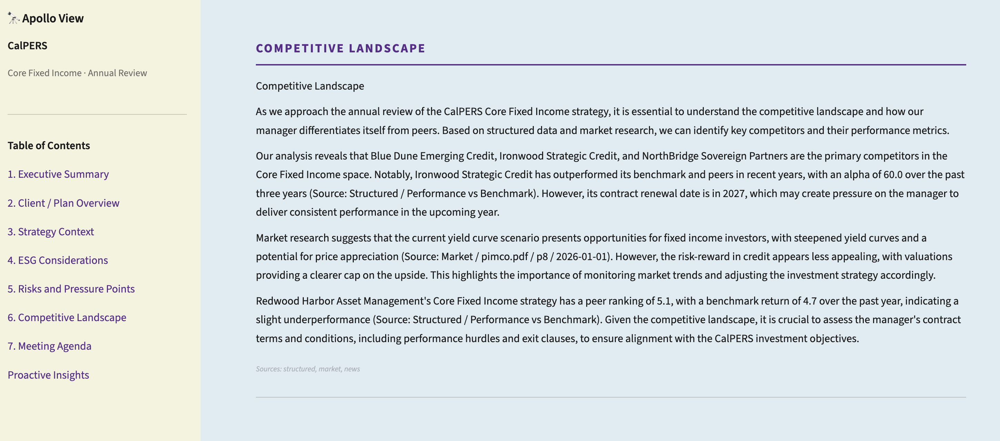
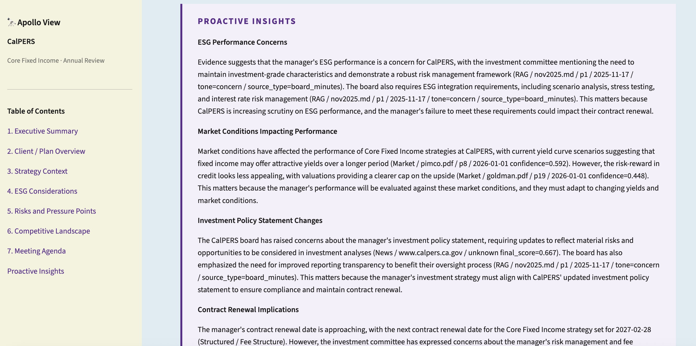

# 🔭 Apollo View

**AI-powered meeting intelligence for investment managers.**

Apollo View takes a manager's meeting details and generates a comprehensive, cited briefing document in a matter of minutes. It searches structured databases, internal documents, market research, and live news simultaneously, detects shifts in board sentiment over time, and surfaces insights that the manager might not have known.

Built as a proof-of-concept for investment managers pitching fixed income strategies to public pension plans.

---

## Demo

> *"Preparing your briefing for CalPERS · Core Fixed Income · RFP Finalist"*

A sample output is available at [`briefing_output.pdf`](briefing_output.pdf).

---

## What do you get?

Enter a plan name, strategy, and meeting type. Apollo View produces a multi-section PDF briefing covering:

1. Plan financials, funded status, and AUM
2. Board member profiles, priorities, and likely question patterns
3. Shifts in board sentiment detected across meeting transcripts over time
4. Competitive landscape and incumbent manager comparison
5. Current macro outlook from PIMCO and Goldman Sachs research
6. Recent news about the plan and the relevant market segment
7. Proactive insights the manager didn't ask about but should know before walking in

### Supported Strategies

| Strategy | Recognized Terms |
|---|---|
| Core Fixed Income | core bond, aggregate, agg, Bloomberg US Aggregate |
| Global Fixed Income | global bond, global aggregate |
| Inflation-Linked | TIPS, linkers, inflation bonds |
| Short Duration | short-term bond, 1-3 year, ultra short |
| Emerging Market Debt | EM debt, EMD, EMBI, sovereign debt |
| High Yield | junk bond, below investment grade, credit spreads |

### Supported Meeting Types

- **Annual Review**: performance, fees, relationship health, renewal risk
- **RFP Finalist**: competitive differentiation, mandate fit, selection criteria
- **First Introduction**: plan context, investment policy, board priorities, relationship entry points

---
# Screenshots

### Input Form
Enter the plan name, strategy, meeting type, date, and any additional notes. All three meeting types are supported from the dropdown.



### Generation Starting
The progress screen is initialised immediately after submission, showing the plan, strategy, and meeting type being prepared, along with an estimated time remaining.





### Live Progress: Steps Completing
Completed steps accumulate as a live log with plain-English summaries: number of research questions generated, database queries answered, documents read, board tone shifts detected, market research passages retrieved, and news articles gathered with their sources.



### Report: Cover Page and Executive Summary
Once complete, the briefing opens automatically. The left sidebar shows the full table of contents with clickable links to each section. The cover page shows the plan, strategy, meeting type, and date. The Executive Summary follows immediately below.



### Report: Strategy Context
Each section is written by the AI using data from the relevant sources, cited inline. This section draws on PIMCO and Goldman Sachs market research, as well as structured performance and contract data.



### Report: ESG Considerations
Sections synthesise across all four data sources. ESG Considerations draws on board documents, market research, and live news to surface ESG-specific risks and requirements that the manager should be prepared to address.



### Report: Competitive Landscape
The Competitive Landscape section identifies peer managers at the plan, their performance relative to the benchmark, and contract renewal timing 


### Report: Proactive Insights
The final section surfaces insights the manager did not explicitly ask about: risks, board concerns, and market dynamics detected across all data sources that are relevant to the meeting but might otherwise be missed.



--- 

## Architecture

Six agents run in sequence, each handling a distinct intelligence layer:

```
Input (plan name · strategy · meeting type)
            ↓
   Agent 1 — Query Decomposition
   Llama 3.2 breaks the meeting context into targeted
   sub-questions for each downstream agent
            ↓
┌──────────────────────────────────────────────────┐
│  Agent 2              Agent 3          Agent 4   │
│  Structured Data      Document RAG     Market    │
│  SQLite keyword       ChromaDB +       Intel     │
│  routing + SQL        BM25 + RRF       ChromaDB  │
│                       + Topic Shift    + BM25    │
│                         Detector                 │
│                                        Agent 5   │
│                                        News      │
│                                       (Tavily)   │
└──────────────────────────────────────────────────┘
            ↓
   Agent 6 — Synthesis
   Llama generates a Table of Contents, then writes
   each section individually with only relevant data.
   A second pass surfaces proactive insights.
            ↓
      HTML + PDF Briefing
```

### Some of my Design Decisions

**Hybrid retrieval (Agents 3 & 4)**: Dense search (sentence-transformers cosine similarity) combined with sparse search (BM25Okapi), merged via Reciprocal Rank Fusion. 

**Topic Shift Detector**: After retrieval, Agent 3 scans all chunks across all questions and flags cases where the same topic (e.g. `duration_risk`, `fee_pressure`) appears with opposite sentiment tones in board documents from different dates - this is to highlight where board opinion has moved over time.

**Multi-call synthesis**: Instead of one large prompt, Agent 6 generates a Table of Contents first, then makes one Llama call per section with only the relevant data subset (max 4,000 chars per section). A 3B model handles focused 300-word sections far better than a single 6,000-word context dump. A final call generates proactive insights across all data.

**Rule-based SQL routing with LLM fallback**: Agent 2 scores each question against keyword banks and routes to pre-written parameterized SQL builders. Llama only generates SQL for questions that don't match any route, and all generated SQL is validated before execution (SELECT only, no dangerous keywords, known tables only).

**Auto-detecting news mode**: Agent 5 checks for a Tavily API key at startup. If present, it runs live search. 

---

## Prerequisites

- Python 3.11+
- [Ollama](https://ollama.com) running locally with `llama3.2` pulled
- Please use the requirements.txt to download the necessary packages.
- A [Tavily API key](https://tavily.com) for live news search (optional; free tier: 1,000 searches/month)

### Install Ollama and pull the model

```bash
# macOS
brew install ollama
ollama pull llama3.2

# Verify
ollama list
```

---

## Setup

The structured database and document embeddings need to be prepared in advance of running. **Both are already committed to the repo for the CalPERS demo scenario, so you can skip Steps 1 and 2 if you just want to run the demo.**

### Step 1 - Build the SQLite database

```bash
python create_calpers_db.py
```

Loads 7 JSON files from `structured-data/` into `calpers.db`. All structured data is simulated — as adeveloper building this POC independently, there is no access to internal data from firms like eVestment or to proprietary manager records. The simulated values are designed to reflect realistic figures for a plan of CalPERS' scale and serve as stand-ins for the real data that would power a production deployment. Safe to re-run.
### Step 2 - Ingest documents into ChromaDB

```bash
python load_and_ingest_docs.py
```

Processes all documents in `unstructured-data/` and builds two vector collections:

> `calpers_docs` — CalPERS-specific documents (board meeting transcripts, investment committee agendas, ACFR, annual investment report, investment policy, RFP materials)
> `market_intel` — Market research (PIMCO Cyclical Outlook, Goldman Sachs Macro Outlook)

Embeddings are saved to `embeddings/` and persist across runs. Subsequent runs only process new or changed files. Takes a maximum of 2–3 minutes on the first run.

**Document sources included:**

```
unstructured-data/
├── calpers-specific-documents/       ← real public CalPERS documents
│   ├── 202503-BoardBOA-0319.pdf
│   ├── 202506-Invest-Agenda-Transcript.pdf
│   ├── 202509-Full-Agenda-Sept-17-transcript.pdf
│   ├── 202509-invest-Agenda-item05a-01_a_0.pdf
│   ├── 202509-invest-Agenda-item05a-04_a_0.pdf
│   ├── 202511-Finance-Agenda-item-5b-01-a.pdf
│   ├── 202511-invest-transcript.pdf
│   ├── acfr-2025.pdf
│   ├── annual-investment-report-fy-2025.pdf
│   └── total-fund-investment-policy.pdf
├── competitive-outlook/              ← real public research reports
│   ├── goldman.pdf
│   └── pimco.pdf
└── example-excerpts/                 ← simulated (see note below)
    ├── june2025.md
    ├── march2025.md
    ├── nov2025.md
    └── rfp-doc.md
```

> **Note on simulated data:** The `example-excerpts/` markdown files are synthetic, i.e,  they simulate the kind of internal meeting notes, investment committee excerpts, and RFP correspondence that a firm would have in practice but which are not publicly available. Similarly, the structured data in `structured-data/` (manager roster, performance history, fee structures, internal meeting notes, competitive intelligence) is simulated to reflect realistic values for a CalPERS-scale plan. The real CalPERS board transcripts and public filings in `calpers-specific-documents/` are genuine public documents. In production, the simulated data would be replaced by actual CRM records, eVestment manager data, and internal meeting archives.

### Step 3 - Set your Tavily API key (optional) in utils.py

---

## Running the App

```bash
# Make sure Ollama is running
ollama serve    # may already be running as a background service

streamlit run app.py
```

---

## Demo Scenario

The repo is pre-loaded with data for the following scenario:

| Field | Value |
|---|---|
| Plan | CalPERS (California Public Employees' Retirement System) | <-- do not change this
| Strategy | Core Fixed Income | --> you can change this and the others

Fill in the form and click **Generate Briefing**. Total runtime is approximately 3–5 minutes, depending on hardware, with a live progress screen showing each step as it completes.

---

## Project Structure

```
apollo-view/
├── app.py                               # Streamlit UI — 4-page single-file app
├── utils.py                             # Shared config, Ollama client, helpers
│
├── agent_01_query_decomposition.py      # Decomposes meeting context into sub-questions
├── agent_02_structured_data.py          # SQLite — fees, performance, board, renewals
├── agent_03_document_rag.py             # Hybrid RAG + Topic Shift Detector
├── agent_04_market_intelligence.py      # PIMCO / Goldman research retrieval
├── agent_05_news.py                     # Tavily live news 
├── agent_06_synthesis.py                # Multi-call synthesis → HTML + PDF
│
├── create_calpers_db.py                 # One-time: builds calpers.db from JSON
├── load_and_ingest_docs.py              # One-time: builds ChromaDB embeddings
│
├── structured-data/                     # 7 JSON source files for SQLite (all are simulated currently)
├── unstructured-data/                   # PDFs and markdown documents
│   ├── calpers-specific-documents/      # 10 real CalPERS board/investment docs
│   ├── competitive-outlook/             # PIMCO + Goldman PDFs
│   └── example-excerpts/               # Simulated meeting transcripts
├── embeddings/                          # ChromaDB persistent storage (auto-created)
│
├── calpers.db                           # Pre-built SQLite database
├── briefing_output.pdf                  # Sample output
└── requirements.txt
```

---

## Extending to a New Plan

1. Add structured data JSON files to `structured-data/` following the existing schema
2. Add plan documents to a new folder under `unstructured-data/` (e.g. `calstrs-specific-documents/`)
3. Re-run `create_calpers_db.py` and `load_and_ingest_docs.py`
4. Pass the new plan name in the UI — agents route by `plan_name` dynamically, no code changes needed

To add a new strategy, add an entry to `STRATEGY_ALIASES` in `agent_02_structured_data.py` with the canonical name and recognized synonyms.

---

## Known Limitations (POC Scope)

- **Single plan** — data layer is scoped to CalPERS. Multi-plan production support would require parameterized database routing and per-plan ChromaDB collections.
- **Local LLM** — Llama 3.2 3B is used for this POC because it runs locally with no API dependency, and I didn't want to pay for/apply for an API key. In practice, it occasionally leaks source metadata into prose and produces inconsistent JSON. A higher-performance model (Claude or a larger Llama variant) would produce significantly cleaner section writing, more consistent structure, and better proactive insights.
- **Static data** — documents and structured data are loaded manually. Production would use automated ingestion pipelines with scheduled refresh.

---

## Production Path

| Component | POC | Production |
|---|---|---|
| LLM | Ollama + Llama 3.2 3B (local) | Claude via API |
| Vector DB | ChromaDB (local) | Pinecone / pgvector |
| Embeddings | sentence-transformers (local) | Hosted embedding API |
| Structured data | SQLite | PostgreSQL / eVestment data APIs |
| News | Tavily free tier | Tavily enterprise / Bloomberg Terminal |
| Document ingestion | Manual | Automated scrapers + nightly refresh |
| Auth | None | SSO / role-based access control |
| Deployment | Local Streamlit | Cloud-hosted, multi-tenant |

---

## Let's collaborate!
